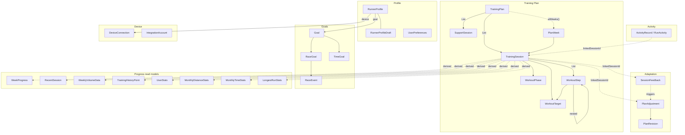
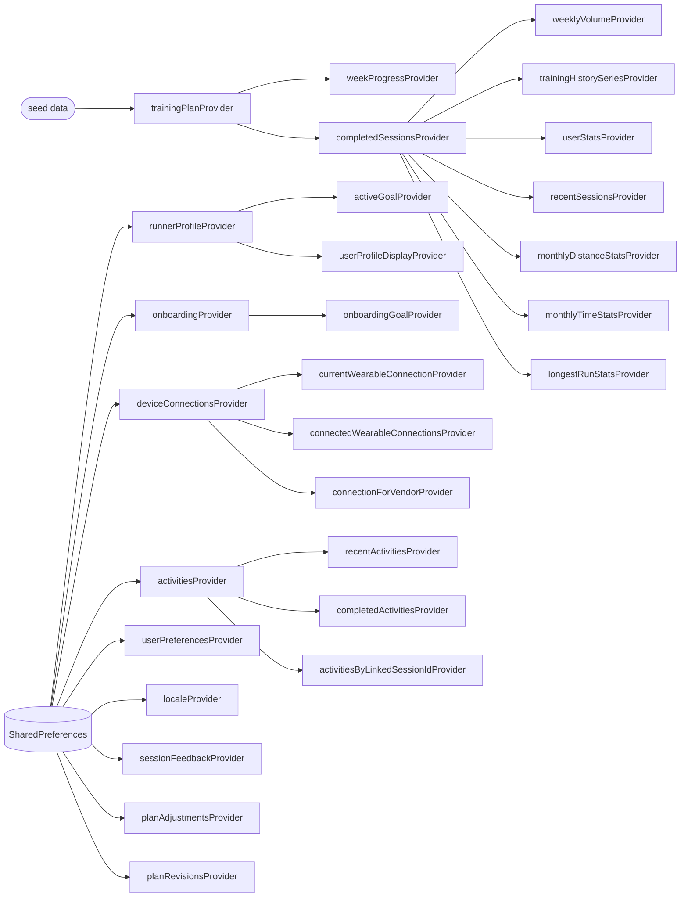
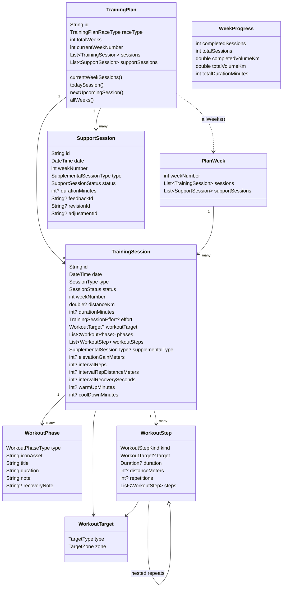
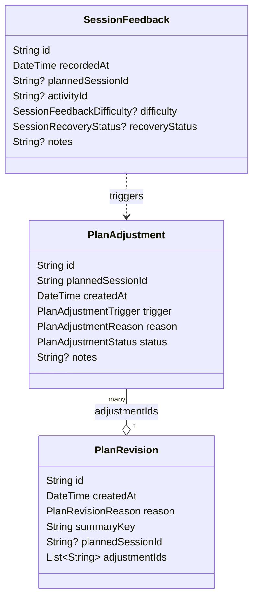
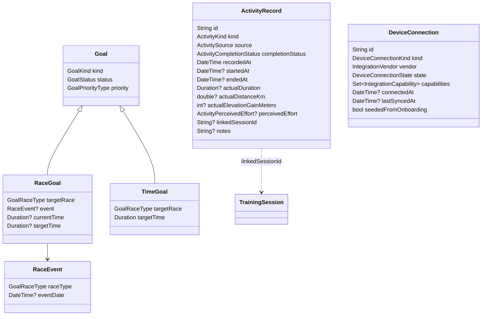
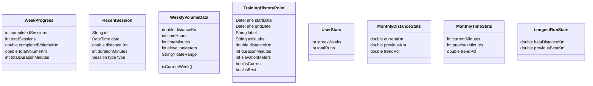
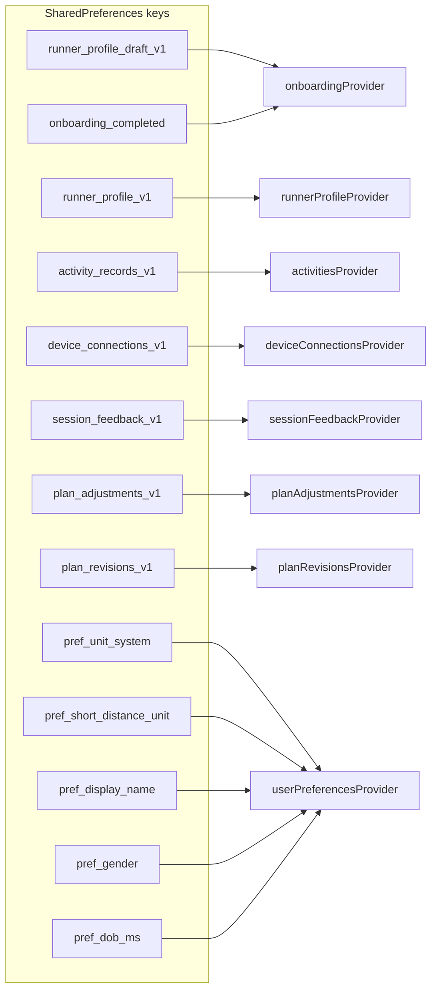

# Data Models

## Current state

The app now has a typed profile layer alongside the seeded training-plan domain:

- `TrainingPlan` remains the main source for planned workouts and most progress projections. It is still seeded locally in `training_plan_seed_data.dart`.
- `RunnerProfileDraft` is the typed, editable onboarding/settings draft state. It is owned by `onboardingProvider` and persisted locally with `SharedPreferences`.
- `RunnerProfile` is the durable completed-profile model. It is owned by `runnerProfileProvider`, persisted locally with `SharedPreferences`, and used for onboarding-complete gating.
- `UserPreferences` and `Locale` remain separate lightweight persisted settings.
- Progress-facing models such as `WeekProgress`, `RecentSession`, and `TrainingHistoryPoint` are still read models derived from `TrainingSession` seed data.

---

## Domain model map

---

## State ownership

| Owner | State shape | Persistence | Notes |
| --- | --- | --- | --- |
| `trainingPlanProvider` | `TrainingPlan` | In memory only | Built from seed data. `skipSession` and `restoreSession` still affect only the current app run. |
| `weekProgressProvider` | `WeekProgress` | None | Computed from `TrainingPlan.currentWeekSessions`. |
| `completedSessionsProvider` | `List<TrainingSession>` | None | Filters completed non-rest sessions and sorts newest first. |
| `weeklyVolumeProvider` | `List<WeeklyVolumeData>` | None | Weekly chart projection derived from completed sessions. |
| `trainingHistorySeriesProvider` | `List<TrainingHistoryPoint>` | None | Bucketed chart projection keyed by `TrainingHistoryRange`. |
| `userStatsProvider` | `UserStats` | None | Current lightweight summary for streaks and completed run count. |
| `recentSessionsProvider` | `List<RecentSession>` | None | Top 3 completed sessions mapped for the progress screen. |
| `monthlyDistanceStatsProvider` | `MonthlyDistanceStats` | None | Current month vs previous month distance totals. |
| `monthlyTimeStatsProvider` | `MonthlyTimeStats` | None | Current month vs previous month duration totals. |
| `longestRunStatsProvider` | `LongestRunStats` | None | Best completed run distance and previous-best comparison. |
| `onboardingProvider` | `RunnerProfileDraft` | `SharedPreferences` | Persists the editable typed draft with versioned storage keys. |
| `runnerProfileProvider` | `RunnerProfile?` | `SharedPreferences` | Persists the completed typed profile and is the current profile source of truth. |
| `userPreferencesProvider` | `AsyncValue<UserPreferences>` | `SharedPreferences` | Persists unit system, short-distance unit, display name, gender, and DOB. |
| `localeProvider` | `AsyncValue<Locale>` | `SharedPreferences` | Persists selected locale with device-locale fallback on first launch. |
| `userProfileDisplayProvider` | `UserProfileDisplay` | None | Read-only plan metadata for profile/home UI. |
| `activitiesProvider` | `List<ActivityRecord>` | `SharedPreferences` (`activity_records_v1`) | Persisted logged activities. |
| `sessionFeedbackProvider` | `List<SessionFeedback>` | `SharedPreferences` (`session_feedback_v1`) | Difficulty/recovery feedback per session. |
| `planAdjustmentsProvider` | `List<PlanAdjustment>` | `SharedPreferences` (`plan_adjustments_v1`) | Pending/applied/dismissed plan tweaks. |
| `planRevisionsProvider` | `List<PlanRevision>` | `SharedPreferences` (`plan_revisions_v1`) | History of plan revision events. |
| `deviceConnectionsProvider` | `List<DeviceConnection>` | `SharedPreferences` (`device_connections_v1`) | Watch and health platform connections. |
| `activeGoalProvider` | `Goal?` | None | Derived from `runnerProfileProvider`. |

---

## Provider dependency graph

---

## Training plan domain

---

## Adaptation domain

---

## Runner profile domain

```mermaid
classDiagram
  class RunnerProfile {
    String id
    DateTime createdAt
    DateTime? completedOnboardingAt
    int schemaVersion
    DateTime updatedAt
    ProfileGender? gender
    DateTime? dateOfBirth
  }

  class GoalProfile {
    RunnerGoalRace race
    bool hasRaceDate
    DateTime? raceDate
    GoalPriority priority
    Duration? currentTime
    Duration? targetTime
  }

  class FitnessProfile {
    RunnerExperience experience
    BinaryChoice canRun10Min
    int runningDays
    WeeklyVolumeRange weeklyVolume
    LongestRunRange longestRun
    TernaryChoice canCompleteGoalDist
    RaceDistanceExperience raceDistanceBefore
    BenchmarkType benchmark
    Duration? benchmarkTime
  }

  class ScheduleProfile {
    Set~WeekdayChoice~ trainingDays
    WeekdayChoice longRunDay
    TimeSlot weekdayTimeSlot
    TimeSlot weekendTimeSlot
    Set~WeekdayChoice~ hardDays
    PreferredTimeOfDay preferredTimeOfDay
  }

  class HealthProfile {
    PainLevelChoice painLevel
    InjuryHistoryChoice injuryHistory
    Set~String~ healthConditions
  }

  class TrainingPreferences {
    PlanPreferenceChoice planPreference
  }

  class DeviceProfile {
    BinaryChoice hasWatch
    WatchDeviceType? device
    DataUsagePreference? dataUsage
    WatchMetricsPreference? watchMetricsPreference
    Set~WatchMetric~ metrics
    TernaryChoice hrZones
    TernaryChoice paceRecommendations
    AutoAdjustPreference autoAdjust
    NoWatchGuidanceChoice noWatchGuidance
  }

  class RecoveryProfile {
    SleepRange sleep
    WorkLevelChoice workLevel
    StressLevelChoice stressLevel
    DayFeelingChoice dayFeeling
  }

  class MotivationProfile {
    Set~MotivationReason~ motivations
    Set~BarrierReason~ barriers
    int confidence
    CoachingToneChoice coachingTone
  }

  RunnerProfile --> GoalProfile : goal
  RunnerProfile --> FitnessProfile : fitness
  RunnerProfile --> ScheduleProfile : schedule
  RunnerProfile --> HealthProfile : health
  RunnerProfile --> TrainingPreferences : trainingPreferences
  RunnerProfile --> DeviceProfile : device
  RunnerProfile --> RecoveryProfile : recovery
  RunnerProfile --> MotivationProfile : motivation
```

---

## Activity & Goal domain

---

## Progress read models

---

## Persistence boundaries

- `RunnerProfileDraft` → `runner_profile_draft_v1` (JSON, versioned)
- `RunnerProfile` → `runner_profile_v1` (JSON, versioned)
- Values use canonical enum keys: `race_half_marathon`, `priority_improve_time`, `day_sun`, etc.
- Routing only considers onboarding complete when a valid persisted `RunnerProfile` exists — the old `onboarding_completed` boolean is no longer the source of truth.

---

## Current typed profile domain

### Editable draft

`RunnerProfileDraft` is a composition of typed draft submodels:

- `GoalProfileDraft`
- `FitnessProfileDraft`
- `ScheduleProfileDraft`
- `HealthProfileDraft`
- `TrainingPreferencesProfileDraft`
- `DeviceProfileDraft`
- `RecoveryProfileDraft`
- `MotivationProfileDraft`

Each draft section stores canonical enums, numbers, booleans, dates, and durations. It does not store localized labels.

### Completed profile

`RunnerProfile` contains the finalized counterparts of the same sections plus profile metadata:

- `goal: GoalProfile`
- `fitness: FitnessProfile`
- `schedule: ScheduleProfile`
- `health: HealthProfile`
- `trainingPreferences: TrainingPreferencesProfile`
- `device: DeviceProfile`
- `recovery: RecoveryProfile`
- `motivation: MotivationProfile`
- `gender: ProfileGender?`
- `dateOfBirth: DateTime?`
- `schemaVersion: int`
- `updatedAt: DateTime`

The completed profile is created from the draft only when every required section can be promoted into a valid final model.

---

## Other implemented model layers

### Training plan domain

| Model | Fields | Notes |
| --- | --- | --- |
| `TrainingPlan` | `id`, `raceType`, `totalWeeks`, `currentWeekNumber`, `sessions`, `supportSessions` | Exposes computed getters `currentWeekSessions`, `todaySession`, `nextUpcomingSession`, `allWeeks`. |
| `PlanWeek` | `weekNumber`, `sessions`, `supportSessions` | Grouping object returned by `TrainingPlan.allWeeks`. |
| `TrainingSession` | `id`, `date`, `type`, `status`, `weekNumber`, `distanceKm`, `durationMinutes`, `description`, `effort`, `phases`, `workoutTarget`, `workoutSteps`, `supplementalType`, `elevationGainMeters`, `intervalReps`, `intervalRepDistanceMeters`, `intervalRecoverySeconds`, `warmUpMinutes`, `coolDownMinutes` | Planned session entity; still mock-data driven. |
| `SupportSession` | `id`, `date`, `weekNumber`, `type`, `status`, `durationMinutes`, `feedbackId`, `revisionId`, `adjustmentId` | Supplemental strength/mobility/drills session. |
| `WorkoutPhase` | `type`, `iconAsset`, `title`, `duration`, `note`, `recoveryNote` | Used by detailed workout views. |
| `WorkoutTarget` | `type`, `zone` | Target type (pace/effort/heartRate) and zone. Serializable. |
| `WorkoutStep` | `kind`, `target`, `duration`, `distanceMeters`, `repetitions`, `steps` | Recursive; supports nested repeat blocks. |
| `SessionFeedback` | `id`, `recordedAt`, `plannedSessionId`, `activityId`, `difficulty`, `recoveryStatus`, `notes` | Runner feedback after completing a session. |
| `PlanAdjustment` | `id`, `plannedSessionId`, `createdAt`, `trigger`, `reason`, `status`, `notes` | A proposed or applied change to the plan. |
| `PlanRevision` | `id`, `createdAt`, `reason`, `summaryKey`, `plannedSessionId`, `adjustmentIds` | Aggregate revision event grouping adjustments. |
| `TrainingSessionEffort` | `easy`, `moderate`, `hard`, `veryEasy` | Optional effort metadata on a session. |
| `SessionType` | canonical session enum | Stored as domain values, not localized strings. |
| `SessionStatus` | `upcoming`, `today`, `completed`, `skipped` | Drives plan and progress UI state. |
| `WeekProgress` | `completedSessions`, `totalSessions`, `completedVolumeKm`, `totalVolumeKm`, `totalDurationMinutes` | Current-week completion summary. |

### Progress read models

| Model | Fields | Notes |
| --- | --- | --- |
| `RecentSession` | `id`, `date`, `distanceKm`, `durationMinutes`, `type` | Small recent-run projection. |
| `WeeklyVolumeData` | `distanceKm`, `timeHours`, `timeMinutes`, `elevationMeters`, `dateRange` | Weekly chart bucket model. |
| `TrainingHistoryPoint` | `startDate`, `endDate`, `label`, `axisLabel`, `distanceKm`, `durationMinutes`, `elevationMeters`, `isCurrent`, `isBest` | General-purpose chart point. |
| `UserStats` | `streakWeeks`, `totalRuns` | Compact progress summary. |
| `MonthlyDistanceStats` | `currentKm`, `previousKm`, `trendPct` | Month-over-month distance summary. |
| `MonthlyTimeStats` | `currentMinutes`, `previousMinutes`, `trendPct` | Month-over-month time summary. |
| `LongestRunStats` | `bestDistanceKm`, `previousBestKm` | Longest-run summary with computed deltas. |

### Activity domain

| Model | Fields | Notes |
| --- | --- | --- |
| `ActivityRecord` (abstract) | `id`, `kind`, `source`, `completionStatus`, `recordedAt`, `startedAt`, `endedAt`, `actualDuration`, `actualDistanceKm`, `actualElevationGainMeters`, `perceivedEffort`, `linkedSessionId`, `notes` | Base class; `RunActivity` is the only concrete implementation today. |

### Goal domain

| Model | Fields | Notes |
| --- | --- | --- |
| `Goal` (abstract) | `kind`, `status`, `priority` | Base; `RaceGoal` and `TimeGoal` are concrete. |
| `RaceGoal` | `targetRace`, `event`, `currentTime`, `targetTime` | Derived from `RunnerProfile.goal`. |
| `TimeGoal` | `targetRace`, `targetTime` | Derived from `RunnerProfile.goal`. |
| `RaceEvent` | `raceType`, `eventDate` | Optional event metadata on a race goal. |

### Device integration domain

| Model | Fields | Notes |
| --- | --- | --- |
| `DeviceConnection` | `id`, `kind`, `vendor`, `state`, `capabilities`, `connectedAt`, `lastSyncedAt`, `seededFromOnboarding` | Represents a connected wearable or health platform. |
| `IntegrationAccount` | `vendor`, `kind`, `supportedCapabilities` | Static descriptor of available integrations per platform. |

---

## Active Run Domain (GPS-based)

> **Deprecated note**: Previous active-run implementations relied on simulated timer-based distance and mock tracking. All mock tracking behavior has been replaced by real GPS tracking via `geolocator`. The `ActiveRunController` now owns authoritative run state sourced from real GPS fixes. Mock distance math and simulated pace/distance increments are no longer present.

### Run persistence tables

The app uses `sqflite` for durable storage of completed and in-progress runs. The database is `runflow_runs.db` with three tables:

| Table | Purpose |
| --- | --- |
| `runs` | Run summary: id, status, timestamps, duration, distance, session linkage, timer-only flag |
| `run_route_points` | GPS fix log: run_id, index, lat/lng, accuracy, altitude, speed, heading, timestamp |
| `run_splits` | Per-kilometer or per-distance splits: run_id, index, boundary, start/end timestamps, duration, pace |

#### `runs`

| Column | Type | Notes |
| --- | --- | --- |
| `id` | TEXT PRIMARY KEY | UUID generated at run start |
| `status` | TEXT | `active` or `completed` |
| `started_at_ms` | INTEGER | Unix ms of run start |
| `ended_at_ms` | INTEGER NULL | Unix ms of run end |
| `duration_ms` | INTEGER | Accumulated run time in ms |
| `distance_km` | REAL | Accumulated GPS distance in km |
| `session_id` | TEXT NULL | Linked `TrainingSession.id` |
| `session_type` | TEXT | Canonical session type key (e.g. `easy`, `tempo`) |
| `timer_only` | INTEGER | 1 if GPS was unavailable and run used timer-only mode |
| `source` | TEXT | Optional source identifier (e.g. for watch or manual import) |

#### `run_route_points`

| Column | Type | Notes |
| --- | --- | --- |
| `run_id` | TEXT | FK to `runs.id`, cascades on delete |
| `idx` | INTEGER | Sequential point index within the run |
| `lat` | REAL | Latitude in degrees |
| `lng` | REAL | Longitude in degrees |
| `accuracy` | REAL | GPS accuracy in meters; points over 60m accuracy are ignored |
| `altitude` | REAL NULL | Altitude in meters |
| `speed` | REAL NULL | Ground speed in m/s |
| `heading` | REAL NULL | Heading in degrees |
| `ts_ms` | INTEGER | Timestamp of the GPS fix |

Route points are batch-inserted every 25 accepted fixes and on run finish to avoid memory pressure during long runs. The `run_id+idx` is the primary key.

#### `run_splits`

| Column | Type | Notes |
| --- | --- | --- |
| `run_id` | TEXT | FK to `runs.id`, cascades on delete |
| `idx` | INTEGER | Split sequence index |
| `boundary_meters` | INTEGER | Distance at split boundary (e.g. 1000 for km splits) |
| `started_at_ms` | INTEGER | Timestamp when split began |
| `ended_at_ms` | INTEGER | Timestamp when split ended |
| `duration_ms` | INTEGER | Split duration in ms |
| `pace_seconds_per_km` | REAL | Computed pace for the split |

### Active run state management

`ActiveRunController` owns authoritative run state during an active session:

- Timer and GPS subscription are owned by the Riverpod notifier, not the UI.
- GPS fixes flow through `RunLocationTracker` (interface + `GeolocatorRunLocationTracker` implementation).
- Accepted fixes are filtered by accuracy (≤60m), minimum movement (≥2m), and maximum speed (≤50 m/s).
- Distance accumulation uses `DistanceAccumulator` with Haversine calculation.
- Pace smoothing uses `PaceSmoother` over the last 5 valid points.

### Run repository

`RunRepository` provides CRUD operations:

- `insertActiveRun` — creates the `runs` row with `status=active` at run start.
- `updateActiveRunSummary` — periodically flushes elapsed duration and distance during an active run.
- `flushPendingRoutePoints` — batch-inserts accepted GPS fixes every 25 points.
- `finishRun` — updates run to `status=completed`, inserts final route points and splits in a transaction.
- `getCompletedRun` — reads run summary with splits and computes average pace.
- `getRoutePoints` / `getSplits` — retrieves persisted fix and split data.

### Strava export

Strava integration (upload of completed runs) is **out of scope for this implementation phase**. Local GPS recording must be complete and stable before any export pipeline is added. Strava export is classified as post-local-recording work and will be addressed in a future sprint after the core run recording loop is validated on physical devices.

---

## Target state

The next domain-model expansions planned after the typed profile foundation are:

1. `Goal` models that separate reusable goal state from onboarding/profile fields.
2. `ActivityRecord` models so logged workouts become durable completed activities independent of planned sessions.
3. Structured `WorkoutTarget` and workout-step models so intervals and targets are machine-readable.
4. `DeviceConnection` and related integration models so watch state lives outside onboarding answers.
5. Adaptation foundations such as session feedback and plan revision records.
6. Strava (and other platform) export pipeline for completed run data.
