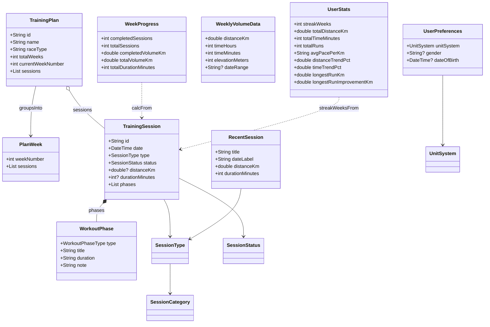

### Derived data notes
- `WeekProgress` and `UserStats` never own raw session data; they recompute aggregates from the live `TrainingSession` list. The new streak logic walks Mondays backwards and only counts weeks containing a completed or today non-rest session, so gaps or rest-only weeks break the streak.
