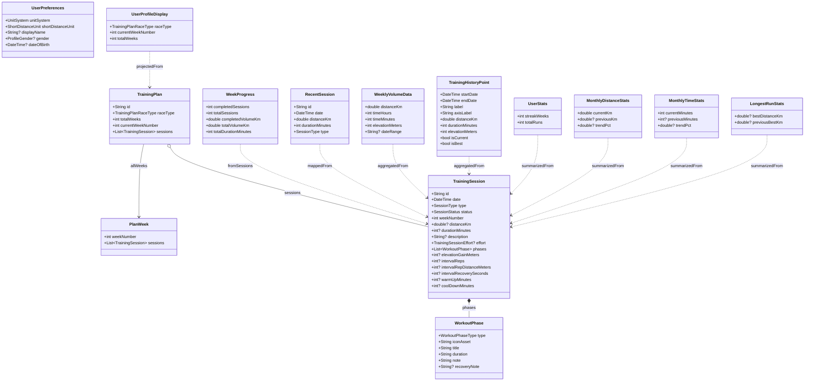

# Data Models

## Current state summary

- `TrainingPlan` is the primary app data model today. It is seeded locally in `training_plan_seed_data.dart` and exposed through `trainingPlanProvider`.
- `UserPreferences` and `Locale` are the only structured values persisted across launches.
- Onboarding answers are not yet represented by a typed domain object. They currently live as a `Map<String, dynamic>` inside `onboardingProvider`.
- Progress-facing models such as `WeekProgress`, `RecentSession`, and `TrainingHistoryPoint` are read models used by the UI and built from `TrainingSession` data.

## State ownership

| Owner | State shape | Persistence | Notes |
| --- | --- | --- | --- |
| `trainingPlanProvider` | `TrainingPlan` | In memory only | Built from seed data. `skipSession` and `restoreSession` only mutate the Riverpod state for the current app run. |
| `weekProgressProvider` | `WeekProgress` | None | Computed from `TrainingPlan.currentWeekSessions`. |
| `completedSessionsProvider` | `List<TrainingSession>` | None | Filters completed non-rest sessions and sorts newest first. |
| `weeklyVolumeProvider` | `List<WeeklyVolumeData>` | None | Weekly chart projection derived from completed sessions. |
| `trainingHistorySeriesProvider` | `List<TrainingHistoryPoint>` | None | Bucketed chart projection keyed by `TrainingHistoryRange`. |
| `userStatsProvider` | `UserStats` | None | Current lightweight summary for streaks and completed run count. |
| `recentSessionsProvider` | `List<RecentSession>` | None | Top 3 completed sessions mapped for the progress screen. |
| `monthlyDistanceStatsProvider` | `MonthlyDistanceStats` | None | Current month vs previous month distance totals. |
| `monthlyTimeStatsProvider` | `MonthlyTimeStats` | None | Current month vs previous month duration totals. |
| `longestRunStatsProvider` | `LongestRunStats` | None | Best completed run distance and previous-best comparison. |
| `userPreferencesProvider` | `AsyncValue<UserPreferences>` | `SharedPreferences` | Persists unit system, short-distance unit, display name, gender, and DOB. |
| `userProfileDisplayProvider` | `UserProfileDisplay` | None | Read-only plan metadata for profile/home UI. |
| `localeProvider` | `AsyncValue<Locale>` | `SharedPreferences` | Persists selected locale with device-locale fallback on first launch. |
| `onboardingProvider` | `Map<String, dynamic>` | In memory only | Stores onboarding answers during the flow. Only the completion flag is persisted. |

## Core model graph

## Model inventory

### Training plan domain

| Model | Fields | Notes |
| --- | --- | --- |
| `TrainingPlan` | `id`, `raceType`, `totalWeeks`, `currentWeekNumber`, `sessions` | Also exposes computed getters `currentWeekSessions`, `todaySession`, `nextUpcomingSession`, and `allWeeks`. |
| `TrainingPlanRaceType` | `fiveK`, `tenK`, `halfMarathon`, `marathon`, `other` | Enum stored on the plan, not localized display text. |
| `PlanWeek` | `weekNumber`, `sessions` | Grouping object returned by `TrainingPlan.allWeeks`. |
| `TrainingSession` | `id`, `date`, `type`, `status`, `weekNumber`, `distanceKm`, `durationMinutes`, `description`, `effort`, `phases`, `elevationGainMeters`, `intervalReps`, `intervalRepDistanceMeters`, `intervalRecoverySeconds`, `warmUpMinutes`, `coolDownMinutes` | The core session entity. Most metrics are nullable so rest days and simpler sessions can omit them. |
| `WorkoutPhase` | `type`, `iconAsset`, `title`, `duration`, `note`, `recoveryNote` | Used by detailed workout views when a session is broken into warm-up/main/cool-down phases. |
| `WorkoutPhaseType` | `warmUp`, `main`, `coolDown` | Enum for workout substructure. |
| `TrainingSessionEffort` | `easy`, `moderate`, `hard`, `veryEasy` | Optional effort metadata on a session. |
| `SessionType` | `easyRun`, `longRun`, `progressionRun`, `intervals`, `hillRepeats`, `fartlek`, `tempoRun`, `thresholdRun`, `racePaceRun`, `recoveryRun`, `crossTraining`, `restDay` | Canonical session type enum. |
| `SessionCategory` | `endurance`, `speedWork`, `threshold`, `raceSpecific`, `recovery`, `rest` | Derived from `SessionType.category`. |
| `SessionStatus` | `upcoming`, `today`, `completed`, `skipped` | Drives plan and progress UI state. |
| `WeekProgress` | `completedSessions`, `totalSessions`, `completedVolumeKm`, `totalVolumeKm`, `totalDurationMinutes` | Created via `WeekProgress.fromSessions(...)` for the current week. |

### Progress read models

| Model | Fields | Notes |
| --- | --- | --- |
| `RecentSession` | `id`, `date`, `distanceKm`, `durationMinutes`, `type` | Small card/list projection for recent completed runs. |
| `WeeklyVolumeData` | `distanceKm`, `timeHours`, `timeMinutes`, `elevationMeters`, `dateRange` | Chart bucket model. `dateRange == null` means the current week. |
| `TrainingHistoryRange` | `week`, `month`, `threeMonths`, `sixMonths`, `year`, `all` | Controls training-history bucketing. |
| `TrainingHistoryPoint` | `startDate`, `endDate`, `label`, `axisLabel`, `distanceKm`, `durationMinutes`, `elevationMeters`, `isCurrent`, `isBest` | General-purpose chart point for training history. |
| `UserStats` | `streakWeeks`, `totalRuns` | The current screen only uses a compact summary model. |
| `MonthlyDistanceStats` | `currentKm`, `previousKm`, `trendPct` | `previousKm` and `trendPct` are nullable when comparison is unavailable. |
| `MonthlyTimeStats` | `currentMinutes`, `previousMinutes`, `trendPct` | Time counterpart to `MonthlyDistanceStats`. |
| `LongestRunStats` | `bestDistanceKm`, `previousBestKm` | Exposes `improvementKm` and `hasRecord` as computed getters. |

### Preferences and lightweight profile state

| Model | Fields | Notes |
| --- | --- | --- |
| `UserPreferences` | `unitSystem`, `shortDistanceUnit`, `displayName`, `gender`, `dateOfBirth` | Persisted locally with `SharedPreferences`. |
| `UnitSystem` | `km`, `miles` | Primary long-distance unit preference. |
| `ShortDistanceUnit` | `meters`, `feet` | Derived default follows `unitSystem`, but can also be stored explicitly. |
| `ProfileGender` | `male`, `female`, `other` | Stored canonically as enum names, not localized labels. |
| `UserProfileDisplay` | `raceType`, `currentWeekNumber`, `totalWeeks` | Small read model assembled from `TrainingPlan`. |

## Onboarding answer schema

The app does not yet have a typed `RunnerProfile` or `OnboardingAnswers` model. Instead, `onboardingProvider` stores grouped answers in a `Map<String, dynamic>`, and string values are expected to use canonical IDs from `onboarding_values.dart`.

| Group | Keys currently written by `OnboardingNotifier` |
| --- | --- |
| Goal | `race:String`, `hasRaceDate:bool`, `raceDate:DateTime?`, `priority:String`, `currentTime:Duration?`, `targetTime:Duration?` |
| Fitness | `experience:String`, `canRun10Min:bool?`, `runningDays:String?`, `weeklyVolume:String?`, `longestRun:String?`, `canCompleteGoalDist:String?`, `raceDistanceBefore:String?`, `benchmark:String?`, `benchmarkTime:Duration?` |
| Schedule | `trainingDays:String`, `longRunDay:String`, `weekdayTime:String`, `weekendTime:String`, `hardDays:List<String>`, `preferredTimeOfDay:String?` |
| Health | `painLevel:String`, `injuryHistory:String`, `healthConditions:String` |
| Training preference | `planPreference:String` |
| Device | `hasWatch:String`, `device:String?`, `dataUsage:String?`, `watchMetrics:String?`, `metrics:List<String>?`, `hrZones:String?`, `paceRecs:String?`, `autoAdjust:String?`, `noWatchGuidance:String?` |
| Recovery | `sleep:String`, `workLevel:String`, `stressLevel:String`, `dayFeeling:String` |
| Motivation | `motivations:List<String>`, `barriers:List<String>`, `confidence:int`, `coachingTone:String` |

## Current modeling gaps

- There is no typed persisted runner-profile model yet. Onboarding answers are still ephemeral map state.
- There is no stored run-log entity separate from `TrainingSession`; completed and skipped status changes live only in the in-memory training plan.
- The seed plan is the only source of session/history data in the repository today.
